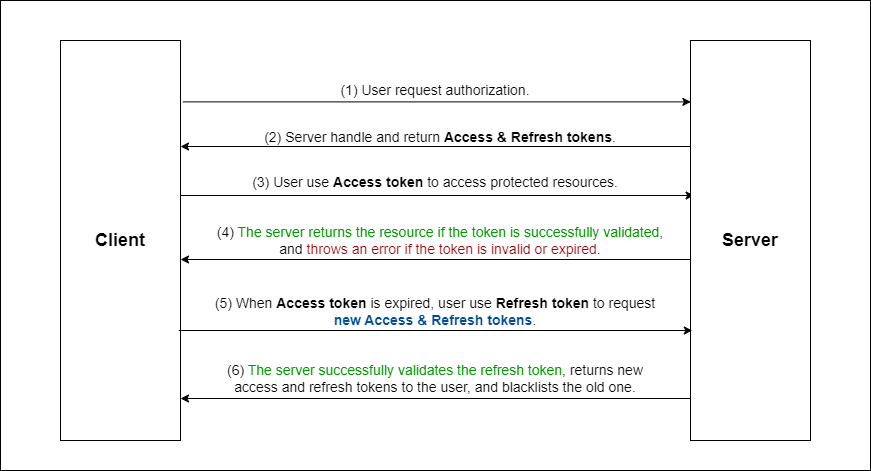

## Introduce

This project is designed as an interview test for the Backend Developer position at PA Infotel.

## Tech Stack

<table>
  <thead>
    <tr>
      <th>Tech Stack</th>
      <th>Version</th>
    </tr>
  </thead>
  <tbody>
    <tr>
      <td>NestJS</td>
      <td>10</td>
    </tr>
    <tr>
      <td>PostgreSQL</td>
      <td></td>
    </tr>
    <tr>
      <td>Redis</td>
      <td></td>
    </tr>
    <tr>
      <td>Docker</td>
      <td></td>
    </tr>
  </tbody>
</table>

## How to Run This Project Locally

1. Create `.database-env.development` from `.database-env.example`
2. In the server folder, create `.env.development` from `.env.example`
3. In the root folder, start the project by running the command (make sure your Docker is running):

   ```sh
   npm run start:dev
   ```

## Access & Refresh Token Implementation

Idea: When a user logs in or registers, the server will authenticate the user based on the provided credentials. If the authentication is successful, the server will return an <b>Access token and Refresh token</b>.

- <b>Access token</b>: This token is attached to the user's requests to access protected routes on the server. However, it has a shorter lifespan compared to the Refresh Token (1 day in this project).

- <b>Refresh token</b>: This token is used to request a new Access Token when the current one expires. When the user sends a request to refresh the token (via the `/api/auth/refresh` route in this project), the server will validate the Refresh Token, issue a new Access Token and Refresh Token, and blacklist the old ones.

- If the Refresh Token expires, the user will need to log in again to obtain a <b>new Access Token and Refresh Token</b>.



## Part 2 of Test: From Concept to Completion

### My progress

- Initially, I load the XML file and parse it to JSON using an external package `(fast-xml-parser)`. Then, I receive the JSON response of the XML files and use these responses to render the `BookingRecord structure` by using the tool <a href="https://transform.tools/json-to-typescript" target="_blank">`JSON to TypeScript`</a>. Finally, I search for the fields required for the final API response and display them.

### My Custom XML - JSON Parser

- Complexity: O(N)
- Idea: I will parse raw XML data (as a string) to a DOM (similar to HTML). Then, I will traverse all nodes of that DOM, extracting attributes and text to merge into the final JSON object.

## Api Endpoints

### Auth routes

- **[POST]** <a href="http://localhost:3000/api/auth/login" target="_blank">`/api/auth/login`</a> : Login route (Use email & password to obtain new <b>Access & Refresh tokens</b>).
- **[POST]** <a href="http://localhost:3000/api/auth/register" target="_blank">`/api/auth/register`</a> : Register route (Use email & password to register account and obtain <b>Access & Refresh tokens</b>).
- **[POST]** <a href="http://localhost:3000/api/auth/logout" target="_blank">`/api/auth/logout`</a> : Logout route (Send Refresh token to logout and blacklist <b>Access & Refresh tokens</b>).
- **[POST]** <a href="http://localhost:3000/api/auth/refresh" target="_blank">`/api/auth/refresh`</a> : Refresh route (Send Refresh token to obtain new <b>Access & Refresh tokens</b> and blacklist old <b>Access & Refresh tokens</b>).
- **[GET]** <a href="http://localhost:3000/api/auth/goole" target="_blank">`/api/auth/google`</a> : Google auth route (Redirects user to the Google authentication page).
- **[GET]** <a href="http://localhost:3000/api/auth/google/callback" target="_blank">`/api/auth/google/callback`</a> : Google auth callback route (User will be redirected to this page after successful authentication by Google).
- **[GET]** <a href="http://localhost:3000/api/auth/google/failure" target="_blank">`/api/auth/google/failure`</a> : Google auth failure route (User will be redirected to this page if authentication fails with Google).

### Bookings routes

- **[GET]** <a href="http://localhost:3000/api/booking/173903" target="_blank">`/api/booking/:id`</a> : Get a booking record by confirmation number. By default, this route uses `fast-xml-parser` to handle XML to JSON conversion. Use the query parameter `?use_external_xml_parser=false` to use a custom XML parser.

### Payment routes

- **[POST]** <a href="http://localhost:3000/api/payment/173903" target="_blank">`/api/payment/:id`</a> : Make a payment using the confirmation number. This route creates a new order and then redirects the user to the checkout link.

- **[GET]** <a href="http://localhost:3000/api/payment/success" target="_blank">`/api/payment/success`</a> : Payment success route (The user will be redirected to this page after a successful payment).

- **[GET]** <a href="http://localhost:3000/api/payment/failure" target="_blank">`/api/payment/failure`</a> : Payment failure route (The user will be redirected to this page after a failed payment).
